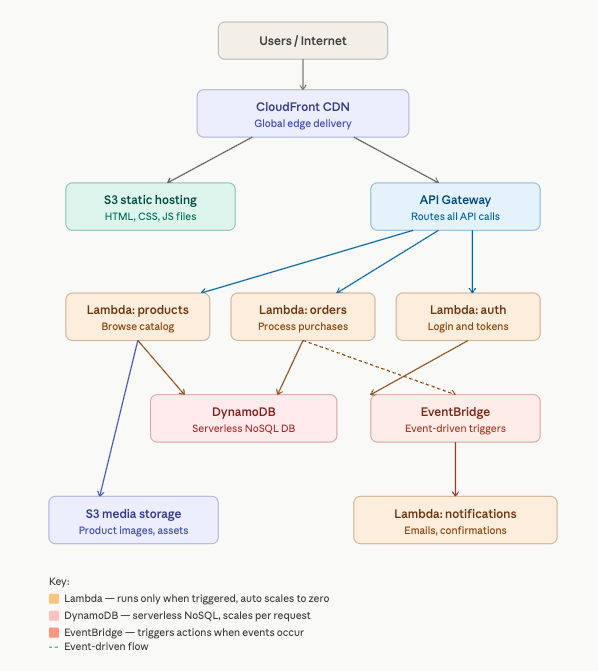

# ErnieMart — Serverless Architecture

## Overview
Same ErnieMart e-commerce platform redesigned using
serverless AWS services. No servers to manage — AWS
handles all infrastructure automatically.

## Architecture Diagram

## Components

### CloudFront CDN
Global content delivery — same as traditional architecture.
Serves static assets from edge locations worldwide.

### S3 Static Hosting
Hosts the entire frontend — HTML, CSS, JavaScript files.
No web servers needed. S3 serves the website directly.

### API Gateway
Front door for all API requests. Routes every user action
to the correct Lambda function. Handles authentication,
rate limiting, and request validation automatically.

### Lambda Functions
Code that runs only when triggered — zero cost when idle.
Scales instantly from 0 to thousands of concurrent
executions in seconds.

- Lambda: products — handles product browsing and search
- Lambda: orders — processes purchases and payments
- Lambda: auth — manages login and user sessions
- Lambda: notifications — sends order confirmation emails

### DynamoDB
Serverless NoSQL database. Stores all application data —
users, orders, products, sessions. Scales automatically
per request. Single-digit millisecond response times.

### EventBridge
Event-driven trigger system. When an order is placed,
EventBridge automatically triggers the notification
Lambda to send confirmation emails. No manual wiring
needed between services.

## Scaling and Management

### Automatic Scaling
Every component scales automatically with zero
configuration. Lambda handles 1 request or 1 million
requests identically. DynamoDB scales per request.
No capacity planning required.

### Operational Overhead
AWS manages all infrastructure — provisioning, patching,
scaling, and maintenance. A team of 3 engineers can
operate what traditionally required 10. Engineers focus
on building features instead of managing servers.

## Security
- API Gateway handles authentication and rate limiting
- Lambda functions use IAM roles with least privilege
- DynamoDB encrypted at rest and in transit
- No servers exposed to public internet