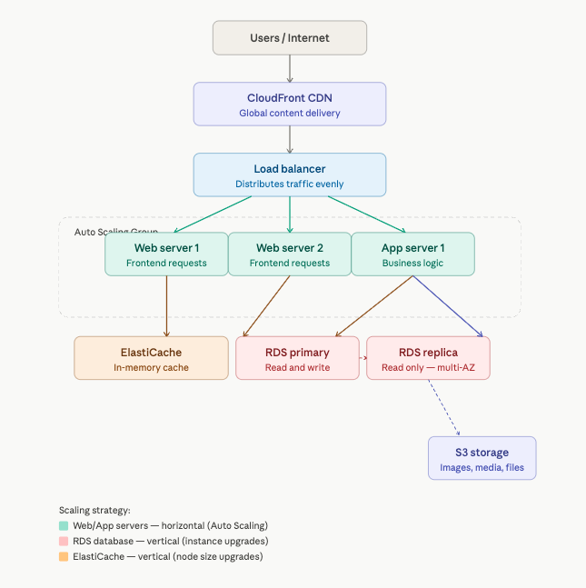

# ErnieMart — Traditional Architecture

## Application Overview
ErnieMart is a scalable e-commerce platform supporting product
browsing, shopping cart, checkout, payments, and order management.

## Architecture Diagram

## Architecture Components

### CloudFront CDN
Global content delivery network serving static assets from
200+ edge locations worldwide. Reduces latency for all users
regardless of geographic location.

### Load Balancer
Distributes incoming traffic across multiple web servers.
Prevents any single server from being overwhelmed during
traffic spikes like Black Friday sales events.

### Web Servers — Auto Scaling Group x3
Handle all user-facing requests. Three instances provide
redundancy and high availability. Scaled horizontally —
add more instances as traffic grows.

### Application Servers — Auto Scaling Group x2
Process all business logic — orders, payments, inventory,
authentication. Separated from web servers for fault
isolation and targeted scaling.

### ElastiCache
In-memory caching layer. Serves frequently accessed data
in microseconds — product listings, prices, homepage
content. Critical during high traffic when thousands of
users view the same products simultaneously.

### RDS Primary Database
Stores all persistent data — users, orders, products,
transactions. Single source of truth.
Scaling: Vertical — upgrade to larger instance types.

### RDS Replica Database
Read-only synchronized copy of primary database. Deployed
in a separate AWS Availability Zone. Can be promoted to
primary if primary fails.

### S3 Storage
Stores product images, videos, and documents. Decoupled
from servers so files remain accessible during outages.

## Scaling Strategy

### Horizontal Scaling — Web and App Servers
Auto Scaling Groups add instances when CPU exceeds 70%.
New instances launch within 2-5 minutes. Scales down
automatically during low traffic to reduce cost.

### Vertical Scaling — Database
RDS instance type upgraded when database becomes a
bottleneck. More effective for databases than horizontal
scaling due to data consistency requirements.

## Security
- SSL encryption on all traffic
- Web Application Firewall on load balancer
- Database not exposed to public internet
- IAM least privilege policies
- S3 bucket policies restricting public access