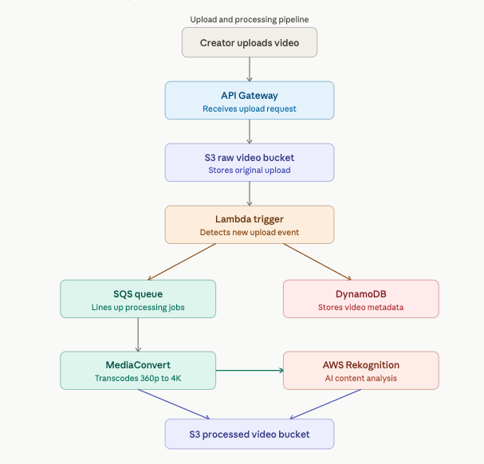
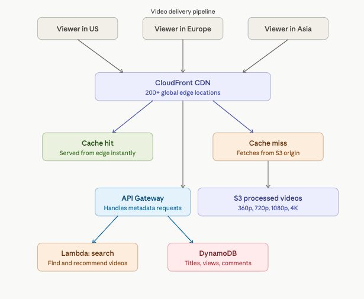

# ErnieTube — Video Sharing Platform System Design

## Platform Overview
ErnieTube is a simplified video sharing platform supporting
video upload, automated transcoding, AI content moderation,
metadata management, and global low-latency video delivery.
Fully serverless and event-driven.

## Architecture Diagrams

### Upload and Processing Pipeline

### Video Delivery Pipeline

## Component Design

### Video Upload — API Gateway + S3
Creators upload high-resolution video through API Gateway
which routes files directly to an S3 raw video bucket.
S3 handles files of any size and triggers downstream
processing automatically on new uploads.

### Processing Queue — SQS
When a new upload lands in S3, a Lambda trigger places
a processing job into an SQS queue. SQS acts like a
ticket system — even if 10,000 videos are uploaded
simultaneously every job is queued and nothing is lost.
MediaConvert processes jobs at its own pace without
being overwhelmed. This pattern is called decoupling.

### Video Transcoding — AWS Elemental MediaConvert
Picks jobs from SQS and transcodes each video into
multiple resolutions — 360p, 480p, 720p, 1080p, and 4K.
Ensures ErnieTube works on any device and any internet
speed. Transcoded versions stored in S3 processed bucket.

### Content Moderation — AWS Rekognition
Analyzes video content automatically for inappropriate
material. Human moderation is too slow, too expensive,
and too resource intensive at scale. Rekognition acts
as a first filter — flagging content in seconds.
Only flagged videos require human review.

### Metadata — DynamoDB
Stores video titles, descriptions, tags, view counts,
likes, and comments.

Why DynamoDB over RDS:
- Flexible schema — every video has different metadata
- Automatic scaling to handle viral traffic spikes
- Single-digit millisecond response times
- Pay-per-request cost model at massive scale
- No rigid spreadsheet structure required

### Video Delivery — CloudFront CDN
Caches processed videos at 200+ edge locations worldwide.
Viewers receive video from the nearest server — reducing
latency from seconds to milliseconds.

Cache hit: video already at edge — served instantly.
Cache miss: video fetched from S3, delivered, then cached.
Viral videos always serve as cache hits at near-zero cost.

## Data Flow

1. Creator uploads → API Gateway → S3 raw bucket
2. S3 event triggers Lambda → job placed in SQS queue
3. Lambda writes metadata → DynamoDB
4. MediaConvert picks job → transcodes all resolutions
5. Rekognition analyzes content → flags if inappropriate
6. Processed videos stored → S3 processed bucket
7. Viewer requests video → CloudFront checks cache
8. Cache hit → served from edge instantly
9. Cache miss → fetched from S3 then cached at edge

## Scalability
Every component scales automatically. S3 handles
unlimited storage. SQS queues unlimited jobs. Lambda
scales to thousands of concurrent executions. DynamoDB
scales per request. CloudFront serves unlimited streams.

## Resilience
SQS ensures no upload jobs are lost during traffic
spikes. S3 provides 99.999999999% durability across
multiple availability zones. CloudFront automatically
routes around failed edge locations.

## Security
- API Gateway handles authentication
- Lambda uses IAM least privilege roles
- S3 bucket policies — raw bucket private, processed
  bucket accessible only through CloudFront
- Rekognition content moderation before videos go live
- DynamoDB encrypted at rest and in transit